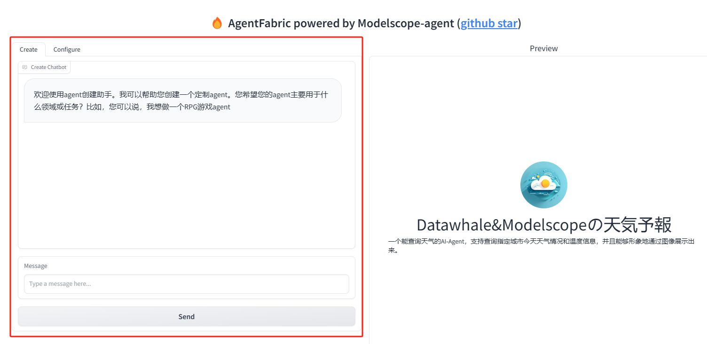

# Agent原理

## 何为Agent

Agent一词起源于拉丁语中的Agere，意思是“to do”。在LLM语境下，**Agent可以理解为在某种能自主理解、规划决策、执行复杂任务的智能体**。

比尔·盖茨曾发过一篇[长文](https://www.gatesnotes.com/AI-agents?ref=blog.glasp.co)，里面如此评价Agent：**“一个对科技行业的冲击波”、“一场自‘输入命令到点击图标’变革之后计算机领域的最大变革”**。

盖茨坦言，现在软件还是相当笨的，不论你想在电脑上做什么，都必须自己选取应用程序。你可以用Word或是谷歌Docs起草商业计划书，但却无法让他们帮你发送电子邮件、分享自拍、分析数据、安排聚会或是购买电影票。因为再顶尖的程序，也没法全面了解你的工作、生活、兴趣爱好与人际关系，能为你做事的能力也极为有限。往往只有通过另一个人，比如你的好朋友或秘书，才有可能实现。

盖茨断言，未来五年，这种情况将彻底改变，你不必再为不同任务选用不同应用程序，只需用日常用语告诉Agent你的需求，Agent就能获取自己能获取到的信息，为你量身定做一个结果。在不久的将来，任何一个上网的用户都能拥有一个由AI驱动的助理，其功能将远超当今技术水平。

举个例子，当你想买一台相机，Agent将会帮你阅读淘宝上所有相机的评论区，总结它们，提出建议，并在您做出决定后帮你下订单，而不是简单的根据价格、销量、好评率等数据筛选商品。

而这所谓的Agent，可以被理解为一颗能自主使用工具、执行任务的“人造大脑”。

**Agent并非ChatGPT升级版，它不仅告诉你“如何做”，更会帮你去做！**

## 进化：从LLM到Agent

人们一直期待能有个强悍的人工智能助手，帮助我们处理日常中各种复杂的问题，完成各种琐碎的任务。而以ChatGPT为首的LLM（大语言模型），因其“全知全能”的表现而闻名全球，同时也在学界和业界消灭了大多数的传统NLP（自然语言处理）任务，开辟了全新的NLP范式，同时被人们寄予厚望，将其看做是通向AGI（通用人工智能）的曙光。

<div align=center>
<figure>
  
</figure>
</div>
<div align=center>图1.1 笔者向ChatGPT咨询专业问题，回答的头头是道</div>


尽管ChatGPT的知识储备接近“全知全能”，但当你试着以AI助手的方式使用时就会发现，它只会“动嘴皮子”，不会“动手”，同时也不能回答一些如天气，时间之类的简单问题。

<div align=center>
<figure>
  
</figure>
</div>
<div align=center>ChatGPT无法回答天气信息</div>


笔者向ChatGPT查询今天天气，ChatGPT委婉的告诉笔者，其无法提供天气信息，原因是

1. 无法浏览互联网
2. 无法获取当前日期

至于为什么ChatGPT连当前日期都获取不了，这就得先了解下LLM的原理了。

关于ChatGPT等LLM最基本的原理，Datawhale有一篇专门的[教程(so-large-lm)](https://github.com/datawhalechina/so-large-lm)，其引言部分写的比较详细。这里我简单阐述下其原理

对于GPT这类生成式语言模型而言，其本质上是一个自回归语言模型（Autoregressive Language Model），所谓自回归语言模型，就是基于序列数据的概率分布，通过建模当前词语与前面已生成词语的条件概率来预测下一个词语。

<div align=center>

</div>

比如上图的例子， 模型输入不完整的一句话，随后每步会迭代输出下一个词组，直到结束。

尽管实际的模型远比这复杂，但总归都是自回归的模型。模型的输入只有文本，输出也只是文本，模型除了会打字，就没其他会的了，至于上网、查时间就没办法了。

尽管模型本身不支持除了打字以外的其他操作，但总有办法能用笔杆子曲线救国的，而这方法就是**Agent**。

## Agent的架构&用ModelScope简单实现一个Agent

OpenAI应用研究主管翁丽莲(Lilian Weng)撰写过一篇blog: [LLM Powered Autonomous Agents](https://lilianweng.github.io/posts/2023-06-23-agent/)，将 Agents 定义为LLM + memory + planning skills + tool use，即大语言模型、记忆、任务规划、工具使用的集合。

<div align=center>
<figure>
  
</figure>
<p>（Lilian Weng定义的Agent结构图）</p>
</div>

其中，LLM是Agent的大脑，属于“中枢”模型，要求有以下3种能力：

1. planning skills：对问题进行拆解得到解决路径，既进行任务规划
2. tool use：评估自己所需的工具，进行工具选择，并生成调用工具请求
3. memory：短期记忆包括工具的返回值，已经完成的推理路径；长期记忆包括可访问的外部长期存储，例如知识库

光说不练假把式，笔者这就用ModelScope的AgentFabric给大家简单实现一个Agent演示下这个流程：

1. 打开AgentFabric
  咱们点开[https://modelscope.cn/studios/modelscope/AgentFabric/summary](https://modelscope.cn/studios/modelscope/AgentFabric/summary)，注册好账户登录进去

  进去后，就会看到左边有一个聊天界面，你不用写任何代码，只需要在这打字就能创建一个Agent，而右边是体验界面，因为我之前创建过的原因，不小心提前泄露了结果。

  <div align=center>
  
  </div>

2. 在聊天框中输入你想要的功能

  这里我给个example，大家懒得打字的就填这个进去

  ```
  我想做一个能查询天气的agent，名字就叫“Datawhale&Modelscopeの天気予報”，要求能查询我指定城市今天的天气情况和温度信息，并画一幅图向我形象的展示出来。
  ```

  可以看到，它在回复的同时，多了2行字，分别是 “✅Config Updated! ✅Logo Updated!”
  这是因为它在帮你调整Agent的配置，以及logo，不信你看看右边的logo和下方的那行小字是不是变了。
  此外它还反问了你一些问题，比如城市和展示风格啥的，你可以不回复它，因为它会问个不停，你根本回复不完。这并不影响右边的Agent使用，当你在使用的过程中觉得效果不符合预期时，再回复让它修改就行。

  <div align=center>
  
  </div>


3. 检查配置&提供Tool
  咱们点进左上角的“Configure”，这里就是Agent的配置了，可以看到配置非常的简单，就是用自然语言做prompt描述功能而已。如果你是个Prompt Engineer，那就大胆的自己写prompt进去试试吧。

  另外下面会有一栏“Capabilities”，这是这个Agent所具备的Tool，如“Wanx Image Generation”就是画画的，“高德天气”就是查天气的，这2个要勾选上，因为Agent要用到。

  <div align=center>
  
  </div>


3. 体验我们的Agent
  好了，现在就可以在右边的聊天框里体验我们的Agent了，这里我输入指令

  ```
  告诉我，今天广州市的天气怎么样？并为其画一幅图。
  ```

  它很给力的查出了广州的天气，并将其画了出来。

  <div align=center>
  
  </div>

  咱们再点开这几个▶试试

  <div align=center>
  
  </div>

  可以看到，在我发出指令后，Agent就已经将我的指令拆分成“天气查询”和“画图”这2个子任务了，并成功的调用了对应的工具完成任务~

参考文献：

[OpenAI打了个“响指”，AI Agent厂商重建护城河｜36氪新风向-36氪 (36kr.com)](https://www.36kr.com/p/2550551402240391)

[AI is about to completely change how you use computers | Bill Gates (gatesnotes.com)](https://www.gatesnotes.com/AI-agents?ref=blog.glasp.co)

[AI Agent统一互联网？ 比尔·盖茨重磅发文：彻底改变人机交互、颠覆软件行业 (qq.com)](https://mp.weixin.qq.com/s/vrF7gW1-aG9JkycA7kdk9A)

[LLM Powered Autonomous Agents | Lil'Log (lilianweng.github.io)](https://lilianweng.github.io/posts/2023-06-23-agent/)

[Lilian Weng on X: "Agent = LLM + memory + planning skills + tool use This is probably just a start of a new era :) https://t.co/Qtp6cHpz2Q" / X (twitter.com)](https://twitter.com/lilianweng/status/1673535600690102273)

[Agent创建专用 · 创空间 (modelscope.cn)](https://modelscope.cn/studios/modelscope/AgentFabric/summary)

[魔搭Agent大本营 · 魔搭社区 (modelscope.cn)](https://www.modelscope.cn/brand/view/agent)

[datawhalechina/so-large-lm (github.com)](https://github.com/datawhalechina/so-large-lm)

[【AI Agent】Agent的原理介绍与应用发展思考 - 知乎 (zhihu.com)](https://zhuanlan.zhihu.com/p/654652104)
