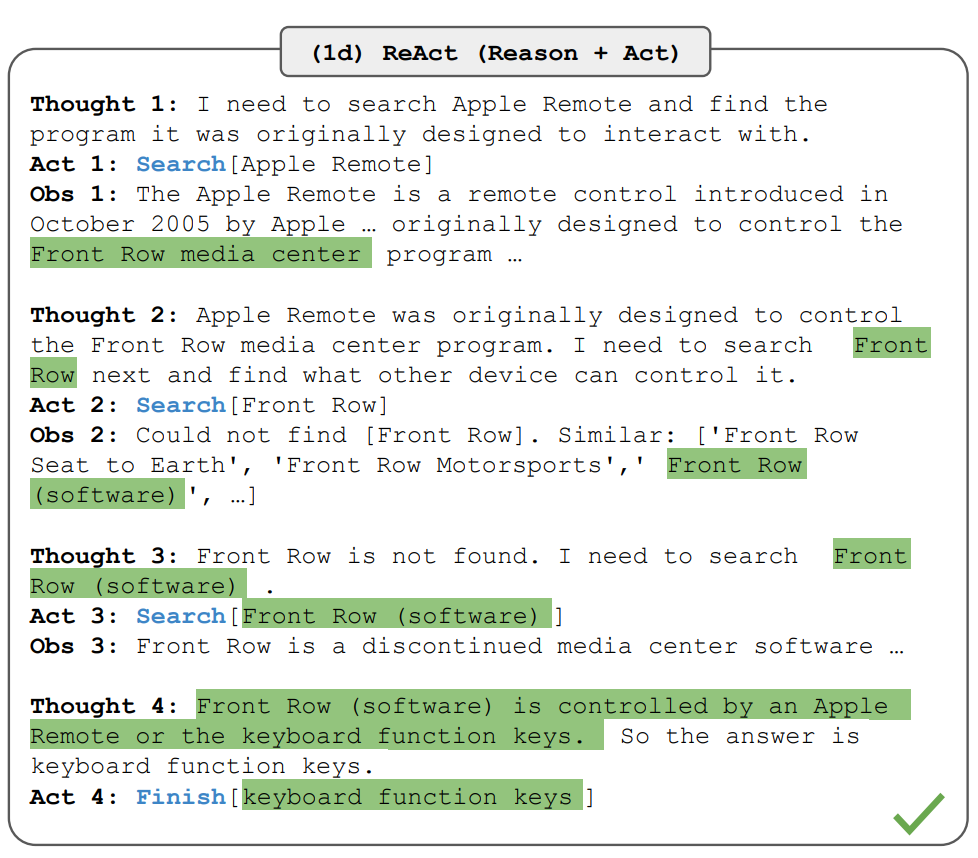
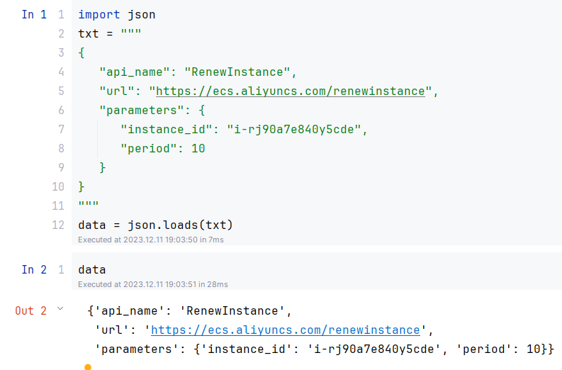
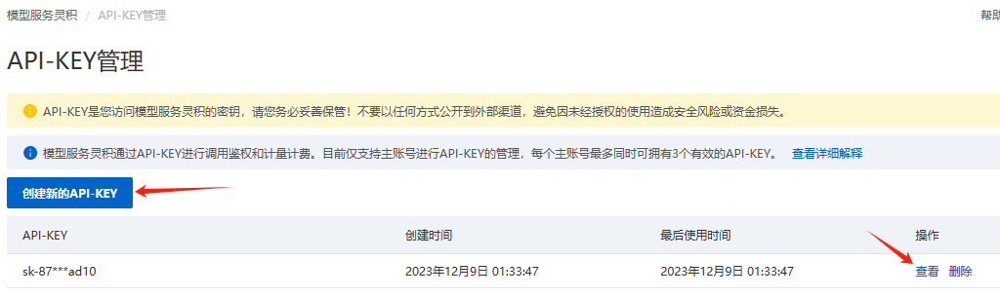
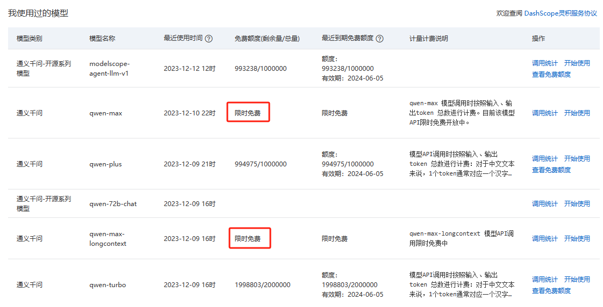
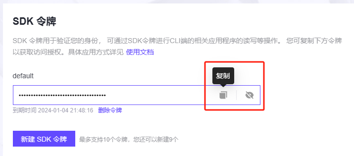
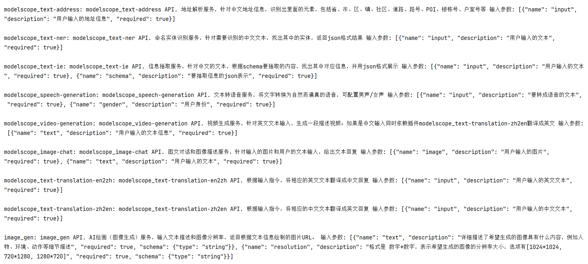
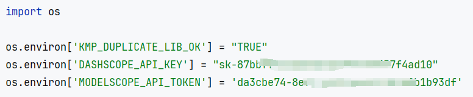

# Agent原理深入+快速搭建demo

## 从prompt的角度再谈Agent
前面提到，Agent的核心是一个LLM（大语言模型），输入是文字、输出也是文字，那究竟是什么让一个语言模型拥有这么强大的能力呢？这之间关键的一点是模型Function Calling（函数调用）的能力。

在没有Function Calling的情况下，模型只能做到对输入的文字进行理解，然后输出对应的文字，没法主动与外部进行交互，只能做思想的巨人，行动的矮子。而有了Function Calling的能力，模型就能主动的与外部进行交互，从而实现更多的功能，这就是Agent的核心能力。

相信有不少同学应该都想过一个问题，如何让LLM不说废话，直接输出某个字眼？有过这个想法的同学，恭喜你，你已经有了Function Calling的雏形。因为这个问题背后的本质是：怎么用代码解析LLM输出的毫无章法的文字？

在各种实际应用中，没人会自找麻烦的解析LLM不可控的输出，而是会事先和LLM约法三章，约定好输出格式，自己按规则进行解析。比如ReAct范数约定的回复格式就是：
- Thought: （LLM的思考/想说的话）
- Action: （想调用的函数）
- Observation: （刚才调用函数的返回）

而在业界，Agent的工作原理和[ReAct](https://arxiv.org/abs/2210.03629)论文的实现大同小异，即"想"清楚再"行动"
<div align=center>
<figure>
  
</figure>
</div>
<div align=center>ReAct的工作流程</div>

工作流程大体是如此，在Action那一步调用函数，Observation返回函数执行结果，但到这步应该还有同学会疑惑，一个语言模型是怎么调用函数的？没关系，下面我接着讲。

这里我用ModelScope-Agent-7B做为Agent中枢，选它的原因主要是prompt更本土化（中文的，方便演示）。

我们以modelscope-agent框架的一个例子为例
https://mp.weixin.qq.com/s/L3GiV2QHeybhVZSg_g_JRw

首先，咱们先注册一个Tool，让Agent调用，代码见下
~~~python
from modelscope_agent.tools import Tool

class AliyunRenewInstanceTool(Tool):
    description = '续费一台包年包月ECS实例'
    name = 'RenewInstance'
    parameters: list = [{
        'name': 'instance_id',
        'description': 'ECS实例ID',
        'required': True
    },
        {
            'name': 'period',
            'description': '续费时长以月为单位',
            'required': True
        }
    ]

    def _local_call(self, *args, **kwargs):
        instance_id = kwargs['instance_id']
        period = kwargs['period']
        return {'result': f'成功为{instance_id}续费，续费时长{period}月'}
~~~
这个Tool的注册很简单，简单的从Tool类继承个子类，然后在子类中定义好这几个属性即可。

1. name
2. description、parameters
3. _local_call（远程版为：_remote_call）

其中，name和description是Tool的基本信息，parameters是Tool的参数信息，_local_call是Tool的调用方法。现在不理解这些没关系，看下面的prompt你就懂了，下面的内容为方便肉眼分析，我把里面的json格式化为了易于人类阅读的格式。


~~~
<|system|>:你是达摩院的ModelScopeGPT（魔搭助手），你是个大语言模型， 是2023年达摩院的工程师训练得到的。你有多种能力，可以通过插件集成魔搭社区的模型api来回复用户的问题，还能解答用户使用模型遇到的问题和模型知识相关问答。


当前对话可以使用的插件信息如下，请自行判断是否需要调用插件来解决当前用户问题。若需要调用插件，则需要将插件调用请求按照json格式给出，必须包含api_name、parameters字段，并在其前后使用<|startofthink|>和<|endofthink|>作为标志。然后你需要根据插件API调用结果生成合理的答复； 若无需调用插件，则直接给出对应回复即可。

1. {
    "name": "RenewInstance",
    "description": "续费一台包年包月ECS实例",
    "parameters": [
        {
            "name": "instance_id",
            "description": "ECS实例ID",
            "required": true
        },
        {
            "name": "period",
            "description": "续费时长以月为单位",
            "required": true
        }
    ]
}

<|user|>:请帮我续费一台ECS实例，实例id是：i-rj90a7e840y5cde，续费时长10个月

<|assistant|>:
~~~

这prompt大概意思是，你现在能用的工具就这个，想调用就在<|startofthink|>和<|endofthink|>中用json格式写出来。

具体怎么写，让我们看看ModelScope-Agent-7B模型的回复

~~~
好的，我现在帮你调用续费接口，请稍等片刻
<|startofthink|>```JSON
{
   "api_name": "RenewInstance",
   "url": "https://ecs.aliyuncs.com/renewinstance",
   "parameters": {
      "instance_id": "i-rj90a7e840y5cde",
      "period": 10
   }
}
```<|endofthink|>
~~~

熟悉json和markdown的同学应该都看出来了，尽管我没要求输出 \```JSON ... \```，但模型还是自动的给我加上了。这里给不熟悉markdown的朋友科普下，这语法是代码块，并且注明了里面的语言是json，如果我不加任何转义符就写在教程里，呈现出的效果就是这样。

~~~JSON
{
   "api_name": "RenewInstance",
   "url": "https://ecs.aliyuncs.com/renewinstance",
   "parameters": {
      "instance_id": "i-rj90a7e840y5cde",
      "period": 10
   }
}
~~~

这是因为，模型的输出能被解析为代码块，因此能用程序定位出json的位置。然后咱们再解析下这段json，出来的结果是这样的

<div align=center>
<figure>
  
</figure>
</div>

相信会python的同学到这步已经看出来了，目标函数的名称和参数都列好了，至于怎么进行function call，相信有点编程基础的都是轻车熟路，我就不多说了。

眼尖的同学可能会注意到，这里面多了个url字段，这纯粹是模型自作多情加上去的，但不影响我们调用函数，可以忽略。

### 用LLM的第一视角体验流程
为方便理解，我基于modelscope-agent和gradio开发了一个小游戏demo，简而言之就是让玩家扮演LLM，自己根据任务要求人工进行规划和函数调用……


链接：

huggingface版：https://huggingface.co/spaces/jianuo/I-am-agent

魔搭版：https://modelscope.cn/studios/nuonuo/I-am-agent/summary


## ModelScope-Agent框架本地安装

尽管ModelScope社区为开发者提供了更加便捷的云开发服务，如[PAI-DSW](https://modelscope.cn/my/mynotebook/preset)和[AgentFabric](https://modelscope.cn/studios/modelscope/AgentFabric/summary)，但我还是要教大家本地开发，一是云开发有一定局限性，二是当你能解决好本地开发中的各种问题如环境配置、依赖安装后，云开发对你来说就是小菜一碟了。

### 1. 安装框架与依赖

第一步需要clone下ModelScope-Agent的代码，然后安装。没安装过git的，看这篇教程安装下：[git安装教程](https://www.liaoxuefeng.com/wiki/896043488029600/896067074338496)

~~~bash
git clone https://github.com/modelscope/modelscope-agent.git
cd modelscope-agent && pip install -r requirements.txt
~~~

### 2. 获取api-key
我们一共要获取2个key，一个是用于LLM推理的dashscope平台的key，一个是用于远程Tool调用的modelscope平台的key（可选）。

首先是dashscope平台的key，直接点击下方链接登录上去就能获取key了
https://dashscope.console.aliyun.com/apiKey
<div align=center>
<figure>
  
</figure>
</div>

这里建议优先用qwen-max或qwen-max-longcontext模型，因为它们是免费的。

<div align=center>
<figure>
  
</figure>
</div>


然后是modelscope平台的key，modelscope-agent内置了一些Tools，可以很方便的调用，但调用它们之前得先获取key。
https://modelscope.cn/my/myaccesstoken

<div align=center>
<figure>
  
</figure>
</div>

下面是modelscope-agent内置的Tools，挺丰富的。

<div align=center>
<figure>
  
</figure>
</div>

### 3. 配置环境变量
在代码开头，咱们直接把之前获取的api key写进环境变量里就行。
此外还要额外设置`KMP_DUPLICATE_LIB_OK=TRUE`，否则容易出现一些玄学BUG，这个BUG一时半会讲不清，详细看我的这篇文章：[就是他！让你的python内核莫名挂掉 | KMP_DUPLICATE_LIB_OK=TRUE 的始作俑者](https://zhuanlan.zhihu.com/p/655915099)
~~~python
import os

os.environ['KMP_DUPLICATE_LIB_OK'] = "TRUE"
os.environ['DASHSCOPE_API_KEY'] = "xxxxxxxxxxxxxx"
os.environ['MODELSCOPE_API_TOKEN'] = 'xxxxxxxxxxxxxx'
~~~

<div align=center>
<figure>
  
</figure>
</div>

### 4. 运行demo
这里我写了2个demo，分别是本地调用自己的Tool和远程调用modelscope-agent内置的Tool，大家进去后看下代码就能照猫画虎的学会写法了。

[本地函数调用demo](./demo-code/本地Function%20demo.ipynb)

[远程函数调用demo](./demo-code/远程Function%20demo.ipynb)

modelscope-agent的文档还不算完善，但主要的功能文档基本都写在repo的README里了，直接看就行。

https://github.com/modelscope/modelscope-agent/tree/master

下面这些是官方的demo，不过可能会因为版本更新的原因跑不通，参考下就好。

https://github.com/modelscope/modelscope-agent/tree/master/demo
