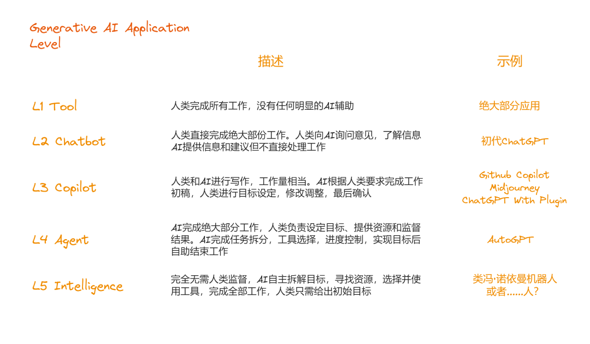
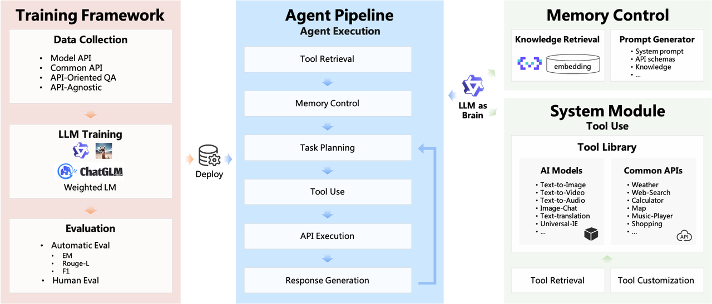
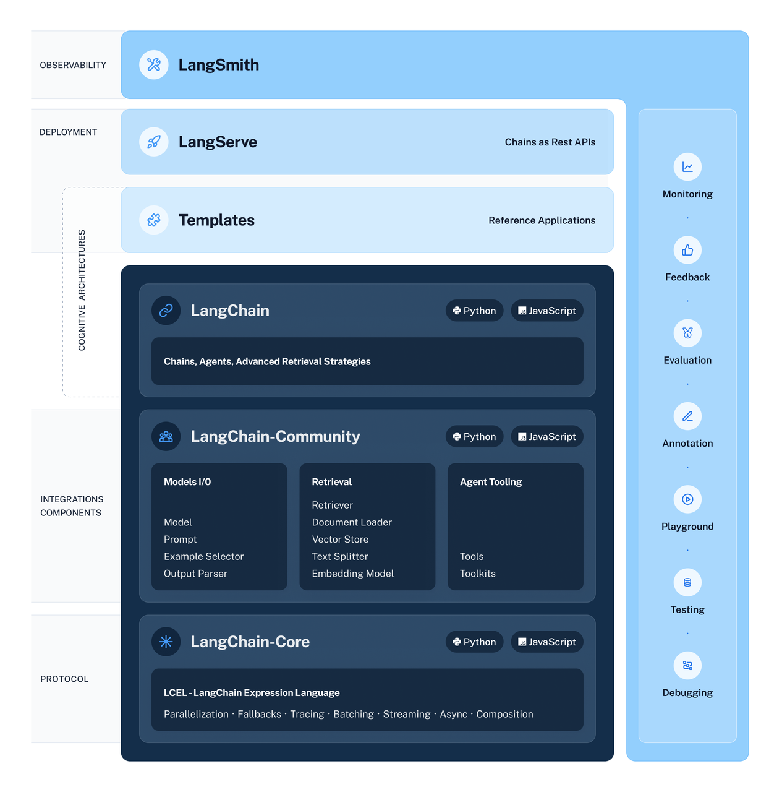
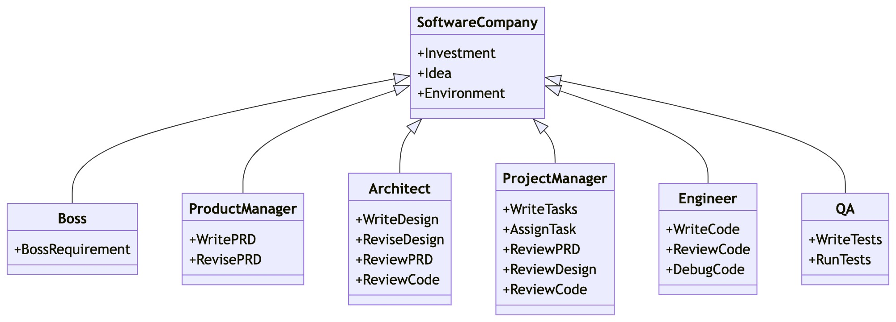

# Agent 通用创作思路
通过前面章节的学习，我们已经对 Agent 有了基本的了解，并能根据教程的说明，通过 [ModelScope Agent](https://github.com/modelscope/modelscope-agent/tree/master) 的框架完成自己的 Agent 构建。

本章将回顾前文所提到的与 Agent 相关的概念，介绍其他 Agent 框架,并总结 Agent 通用创作思路 和未来的发展前景。

## 回顾 Agent 相关概念
LLM的潜力不仅限于生成写得很好的副本、故事、文章和程序，通过 构建Agent级别的应用 ，还可以作为一种强大的工具解决通用问题。

<figure>
  
</figure>

生成式AI产品的分级 @ZhenFund

Agent 可大致被定义为如下图所示的系统：Agents = LLM + memory + planning skills + tool use

<figure>
  
</figure>

由LLM驱动的Autonomouse Agent 系统  
@Lilian Weng

Agent 在 Planning（规划）的过程中，涉及到拆解步骤（Subgoal decomposition）并提前规划（Chain of thoughts），并在进行相应的 执行与反思（Self-critics + Reflection），对过去执行的动作进行反思，以进一步推进任务进展。

执行与反思，目前大部分 Agent 框架，都会使用 ReAct (Reason + Act) 的框架进行实现，即 Thought + Action + Observation 框架：

<figure>
  
</figure>

知识密集型任务（如HotpotQA、FEVER）和 
决策型任务（如AlfWorld Env、WebShop） 
的推理轨迹示例 
@Shunyu Yao等

## 常见的主流 Agent 框架简介
除了魔搭开源的ModelScope-Agent，AI Agent 领域还有许多开源框架，它们各自有不同的特点和应用场景，一些较为常见的主流框架有：

### [ModelScope-Agent](https://github.com/modelscope/modelscope-agent/blob/master/README_CN.md)

[ModelScope-Agent](https://github.com/modelscope/modelscope-agent/blob/master/README_CN.md)是由阿里云AI模型社区魔搭（ModelScope）2023.8.7发布的开源框架，代码清晰简洁。

提供了一个通用的、可定制的Agent框架。它提供了一个用户友好的系统库， 具有可定制且功能全面的框架、使用开源LLMs作为核心组件、支持多样化且全面的API。

<figure>
  
</figure>

并提供了[AgentFabric](https://github.com/modelscope/modelscope-agent/tree/master/apps/agentfabric)应用，可快速创建一个基本的Agent，并已部署上线在[创空间](https://modelscope.cn/studios/modelscope/AgentFabric/summary)。

<figure>
  
</figure>

AgentFabric最新UI

相关论文详见：[ModelScope-Agent: Building Your Customizable Agent System with Open-source Large Language Models](https://arxiv.org/abs/2309.00986)

### [Langchain](https://github.com/langchain-ai/langchain)

[Langchain](https://github.com/langchain-ai/langchain)
由 Harrison Chase 2022 年 10 月开源，并迅速转变为一家初创公司，是一个轻量级框架，专门用于构建基于LLM的应用，不仅限于 Agent 应用，其中关于Agent的开发方法可查看其文档中的[Agents | 🦜️🔗 Langchain](https://python.langchain.com/docs/modules/agents/)。

<figure>
  
</figure>

但Agent不是其主要框架，而是其中一个功能，其常见的应用方案是外接知识库，通过向量化的方式给LLM外接一个大脑。​

### [MetaGPT](https://github.com/geekan/MetaGPT)

[MetaGPT](https://github.com/geekan/MetaGPT)由DeepWisdom于2023年8月1号发布，是一个多智能体协作的框架，旨在解决基于大型语言模型（LLMs）的多智能体协作中的复杂问题，核心理念是使 GPTs 组成软件公司，将SOP具象化，通过SOP(Team)协作处理更复杂的任务。

<figure>
  
</figure>

### Agently

### AutoGPT

### BabyGPT

## 通用创作思路参考

# 参考资料
1. [万字长文！何谓Agent，为何Agent？](https://mp.weixin.qq.com/s/jFf0fmZLehLDaNNzgqeAIQ)
2. [魔搭社区推出ModelScope-Agent开发框架，打造属于你的智能体](https://mp.weixin.qq.com/s/L3GiV2QHeybhVZSg_g_JRw)
3. [生成式 AI 的评估和监视指标 - Azure AI Studio](https://learn.microsoft.com/zh-cn/azure/ai-studio/concepts/evaluation-metrics-built-in)
4. [LangChain Agent 原理解析](https://zhuanlan.zhihu.com/p/655141968)
5. [GPT Engineer 实践与源码解析](https://zhuanlan.zhihu.com/p/667865664)
6. [我为什么放弃了 LangChain？](https://zhuanlan.zhihu.com/p/645358531)
7. [LangChain：介绍与入门](https://zhuanlan.zhihu.com/p/639458788)
8. [LangChain 中文文档 v0.0.291 | 🦜️🔗 Langchain](https://python.langchain.com.cn/docs/)
9. [一文详解最热的 LLM 应用框架 LangChain](https://zhuanlan.zhihu.com/p/651151321)