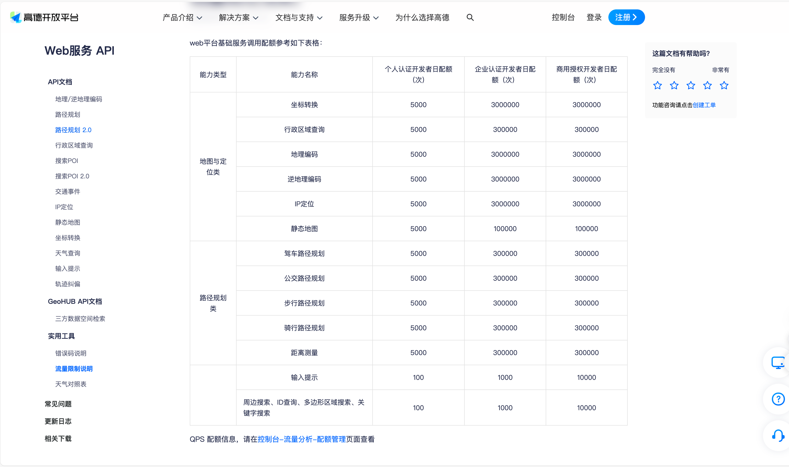
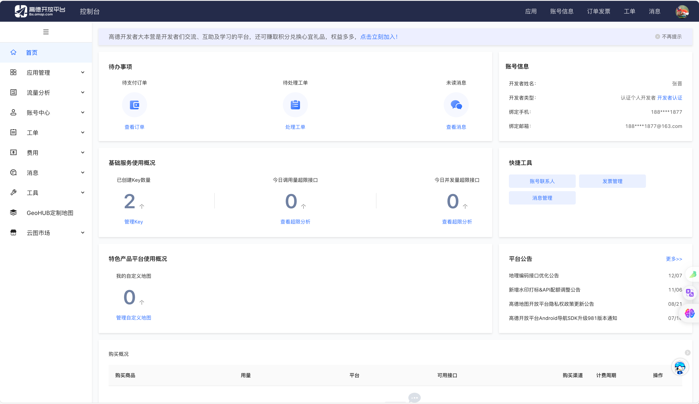
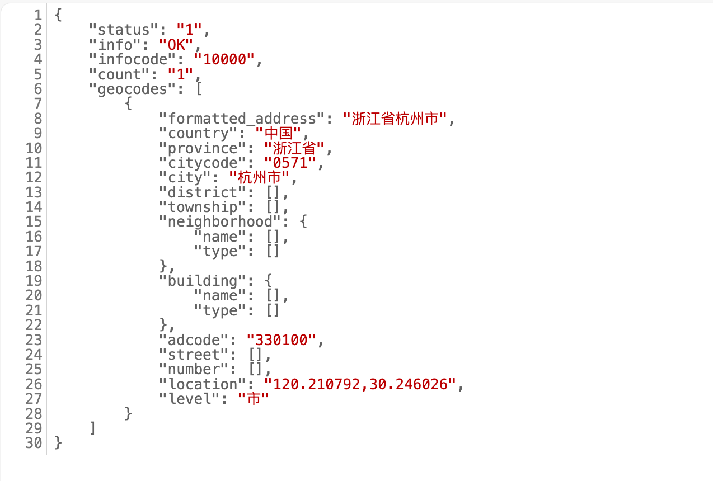
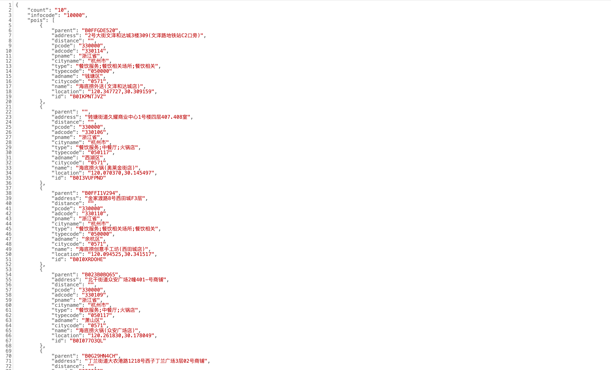

为了帮助大家更好的构建Agent，我们首先针对高德开放API做一些专项讲解，以帮助大家理解这些API所提供的能力。同时也希望大家自己可以探索更多的开发API积极融入到自己的agnet开发中

## 高德API介绍

[高德地图开放API](https://lbs.amap.com/api/)是高德地图提供的一套开放接口，可以实现地图展示、地理编码、逆地理编码、路径规划、地点搜索等功能。开发者可以通过调用这些API来实现自己的地图应用。

[高德Web服务API](https://lbs.amap.com/api/webservice/summary)开放了大量能力，并且提供给个人开发者较多的调用次数，完全能够满足个人开发者日常开发需求。

## 创建高德API的AK

### 注册登陆
点击注册按钮，完成注册后即可登陆

登陆后进入控制台

### 生成AK
进入应用管理，创建应用并生成AK，这个AK是我们调用API能力的密钥。

## 高德API的调用

### 地理/逆地理编码

[地理编码/逆地理编码API](https://lbs.amap.com/api/webservice/guide/api/georegeo) 是通过 HTTP/HTTPS 协议访问远程服务的接口，提供结构化地址与经纬度之间的相互转化的能力。

结构化地址的定义： 首先，地址肯定是一串字符，内含国家、省份、城市、区县、城镇、乡村、街道、门牌号码、屋邨、大厦等建筑物名称。按照由大区域名称到小区域名称组合在一起的字符。一个有效的地址应该是独一无二的。注意：针对大陆、港、澳地区的地理编码转换时可以将国家信息选择性的忽略，但省、市、城镇等级别的地址构成是不能忽略的。暂时不支持返回台湾省的详细地址信息。

调用示例：https://restapi.amap.com/v3/geocode/geo?key=AK=%E6%B5%99%E6%B1%9F%E7%9C%81%E6%9D%AD%E5%B7%9E%E5%B8%82%E6%B5%B7%E5%BA%95%E6%8D%9E%E7%81%AB%E9%94%85(%E5%A5%A5%E8%8E%B1%E9%87%91%E8%A1%97%E5%BA%97)

调用结果：

### POI搜索接口

[地点搜索服务2.0](https://lbs.amap.com/api/webservice/guide/api/newpoisearch)是一类Web API接口服务；服务提供多种场景的地点搜索能力，包括关键字搜索、周边搜索、多边形区域搜索、ID搜索。

- **关键字搜索**：开发者可通过文本关键字搜索地点信息，文本可以是结构化地址，例如：北京市朝阳区望京阜荣街10号；也可以是POI名称，例如：首开广场；

- **周边搜索**： 开发者可设置圆心和半径，搜索圆形区域内的地点信息；

- **多边形区域搜索**：开发者可设置首尾连接的几何点组成多边形区域，搜索坐标对应多边形内的地点信息；

- **ID搜索**： 开发者可通过已知的地点ID（POI ID）搜索对应地点信息，建议结合输入提示接口使用。

调用示例：https://restapi.amap.com/v5/place/text?key=AK&keywords=%E6%B5%B7%E5%BA%95%E6%8D%9E&region=%E6%9D%AD%E5%B7%9E

调用结果：

### 路径规划
[路线规划接口2.0](https://lbs.amap.com/api/webservice/guide/api/newroute)是一类Web API接口服务，以HTTP/HTTPS形式提供了多种路线规划服务。支持驾车、公交、步行、骑行、电动车路线规划。

- **驾车路线规划**：开发者可根据起终点坐标检索符合条件的驾车路线规划方案，支持一次请求返回多条路线结果、支持传入多个途经点、支持传入车牌规避限行、支持根据不同业务场景设置不同的算路策略等。

- **步行路线规划**： 开发者可根据起终点坐标检索符合条件的步行路线规划方案。

- **公交路线规划**： 开发者可根据起终点坐标检索符合条件的公共交通路线规划方案，支持结合业务场景设置不同的公交换乘策略。

- **骑行路线规划**： 开发者可根据起终点坐标检索符合条件的骑行路线规划方案。

- **电动车路线规划**： 开发者可根据起终点坐标检索符合条件的电动车路线规划方案，与骑行略有不同的是会考虑限行等条件。

调用示例：从当前位置（120.061159,30.255079 西溪湿地附近）驾驶导航前往海底捞火锅(奥莱金街店)
https://restapi.amap.com/v5/direction/driving?key=AK&origin=120.061159,30.255079&destination=120.070370,30.145497&destination_id=B0I3VUFPND&show_fields=cost

调用结果：

